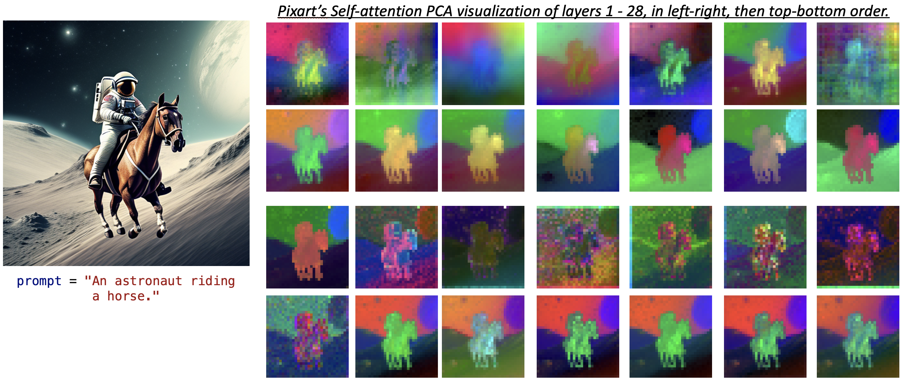
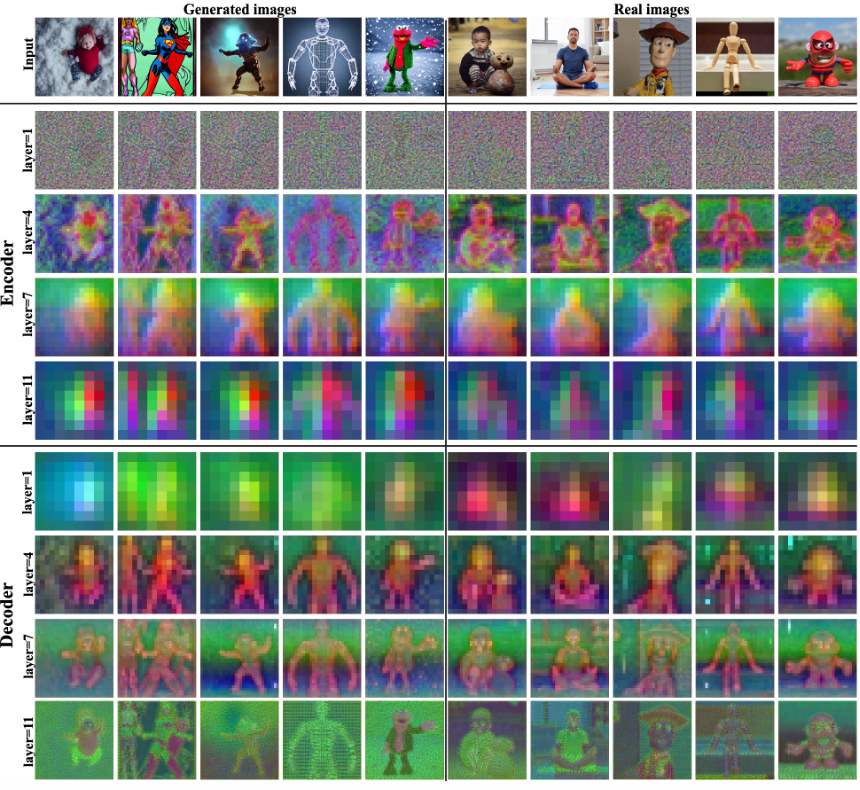

# DiT-Visualization

This project aims to explore the differences in feature aspects between DiT-based diffusion models and Unet-based diffusion models. We found that DiT-based diffusion models have consistent feature scales across different layers, while Unet models exhibit significant changes in feature scales and resolutions across different layers.

## Visualization
DiT visualization:


SD visualization:


## Acknowledgements
The project utilizes code from the following repositories:
- [diffusers](https://github.com/huggingface/diffusers)
- [Plug-and-Play](https://github.com/MichalGeyer/plug-and-play)
- [PixArt](https://github.com/PixArt-alpha/PixArt-alpha?tab=readme-ov-file)

## Citation

If you use this project in your research, please cite the following:

```bibtex
@misc{guo2024dit,
  author = {Qin Guo and Dongxu Yue},
  title = {DiT-Visualization},
  year = {2024},
  howpublished = {\url{https://github.com/guoqincode/DiT-Visualization}},
  note = {Exploring the differences between DiT-based and Unet-based diffusion models in feature aspects using code from diffusers, Plug-and-Play, and PixArt}
}
